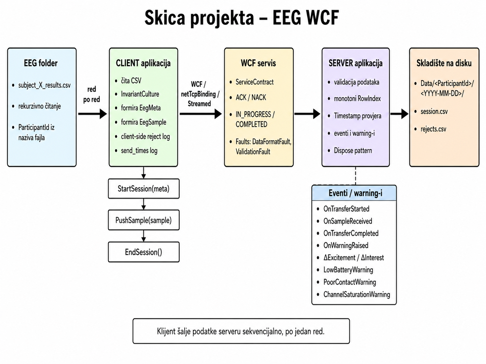

# Virtuelizacija Procesa — EEG WCF projekat

Projekat je **„Razmena i skladištenje EEG podataka iz CSV-a korišćenjem WCF servisa, fajl sistema i događajnog modela“**.

## 1. Arhitektura

```text
EEG CSV fajlovi
      ↓
EegWcfSystem.Client
      ↓  StartSession(meta), PushSample(sample), EndSession()
WCF netTcpBinding servis
      ↓
EegWcfSystem.Server
      ↓
Data/<ParticipantId>/<YYYY-MM-DD>/session.csv
Data/<ParticipantId>/<YYYY-MM-DD>/rejects.csv
```

Projekat ima tri dijela:

- `EegWcfSystem.Common` — zajednički WCF ugovor, modeli i fault klase.
- `EegWcfSystem.Client` — čita CSV fajlove, parsira redove i šalje ih serveru.
- `EegWcfSystem.Server` — hostuje WCF servis, prima podatke, validira, upisuje i generiše događaje/warning-e.


### Vizuelna skica arhitekture



## 2. Gdje su StartSession, PushSample i EndSession?

Definicija ugovora:

```text
EegWcfSystem.Common/Contracts/IEegService.cs
```

Klijent ih poziva ovdje:

```text
EegWcfSystem.Client/Program.cs
```

Server ih implementira ovdje:

```text
EegWcfSystem.Server/Services/EegService.cs
```

Najbitnija metoda za slanje podataka je:

```csharp
proxy.PushSample(sample);
```

To je mjesto gdje se jedan parsirani CSV red šalje sa klijenta na WCF servis.


## 3. Pokrivenost PDF zadataka

| Zadatak | Implementacija |
|---|---|
| 1. Skica sistema i protokol | `README.md`, `ARHITEKTURA_I_PROTOKOL.md`, `IEegService.cs` |
| 2. WCF servis, ugovori, konfiguracija | `IEegService.cs`, `EegMeta.cs`, `EegSample.cs`, oba `App.config` fajla |
| 3. Validacija i fault izuzeci | `EegService.cs`, `EegFaults.cs` |
| 4. Dispose pattern | `EegCsvReader.cs`, `RejectLogger.cs`, `SendTimeLogger.cs`, `SessionWriter.cs`, `EegService.cs` |
| 5. CSV učitavanje | `EegCsvReader.cs`, `Program.cs`, folder `EEG/` |
| 6. session.csv i rejects.csv | `SessionWriter.cs` |
| 7. Sekvencijalni prenos i log vremena slanja | `Program.cs`, `SendTimeLogger.cs` |
| 8. Delegati i događaji | `EegService.cs` (`OnTransferStarted`, `OnSampleReceived`, `OnTransferCompleted`, `OnWarningRaised`) |
| 9. ΔExcitement i ΔInterest | `EegService.cs`, metoda `AnalyzeWarnings` |
| 10. Baterija, kontakt, saturacija kanala | `EegService.cs`, metoda `AnalyzeWarnings` |

## 4. EEG baza podataka

U projekat je ubačena stvarna baza iz fajla `EEG.rar`. U toj arhivi se nalazi 20 CSV fajlova:

```text
EegWcfSystem.Client/EEG/subject_1_results.csv
...
EegWcfSystem.Client/EEG/subject_20_results.csv
```

Ukupno ima 874411 redova podataka bez header-a. Kod ne zavisi od fiksnog broja fajlova, već rekurzivno obrađuje sve fajlove oblika `subject_*_results.csv` koje nađe u `EEG/` direktorijumu.


## 5. Simulacija prekida veze

U `EegWcfSystem.Client/App.config` postoji:

```xml
<add key="SimulateBreakAfterRows" value="0" />
```

Za normalan rad ostaje `0`. Za demonstraciju prekida veze možeš staviti npr. `10`; klijent će prekinuti poslije 10 poslatih redova, a `finally` blok i `Dispose` će zatvoriti reader/log resurse.
